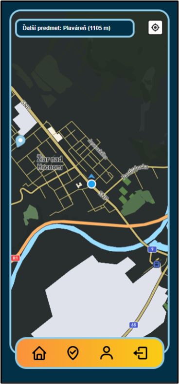
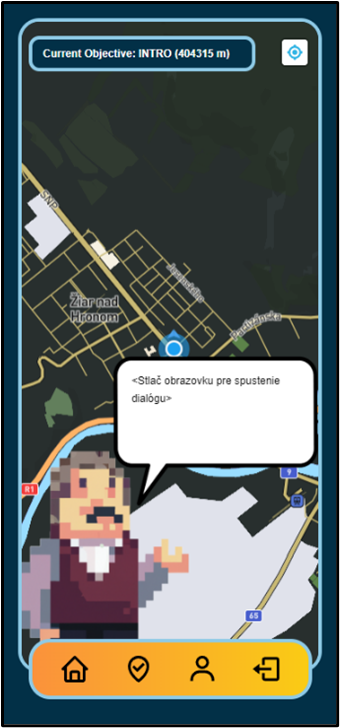

# Diego's Journey
## Geolocation based mobile game

The game is called Diego's Journey, it's designed for smartphone & uses the current position of the device, and guides the player through a linear story about the protagonist Diego.

### User Interface

Login Page             |  Game menu          | Dialogue screen
:-------------------------:|:-------------------------: | :-------------------------:
 |  | 

### Used stack
- ReactJS
- Tailwind CSS
- Framer Motion
- Dall-E 2
- Mapbox
- Supabase

## Try the game for yourself

To test the game for yourself withtout the need to visit the specified location with your phone add these points into the Sensor menu in Chrome developer tools.

Name | LAT | LON
:-: | :-: | :-:
Plážové kúpalisko | 48.586 | 18.867
Kaštieľ | 48.585 | 18.863
Pump track dráha | 8.585 | 18.855
Planetárium | 48.586 | 18.851
Slovalco Aréna | 48.586 | 18.846
Plaváreň | 48.592 | 18.844
Skatepark | 48.600 | 18.840
Nemocnica | 48.590 | 18.842

### Video Preview

### Live Preview
The game itself is hosted on vercel and can be found [here](https://diego-react.vercel.app/).